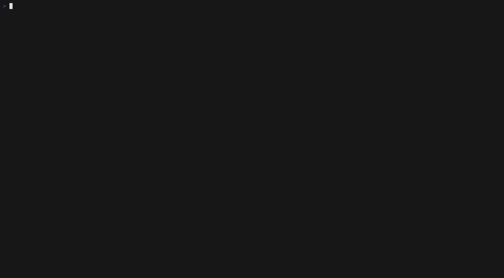

# ripe

### **R**ust **I**nternet **P**ipe **E**ngine

**Yahoo Pipes, reborn in your terminal.** ripe is a TUI for building feed
pipelines as a visual DAG — fetch RSS/JSON/CSV, filter, transform, merge,
sort, and emit a new feed — plus a headless runner for cron.



Two binaries, one pipe format:

- **`ripe`** — the editor. Wire modules on a canvas, watch the live preview
  re-evaluate as you edit, save as a `.pipe` file (plain JSON).
- **`ripe-run`** — the runner. Evaluate a saved pipe and print (or write) the
  output feed. Point cron at it.

## Quick start

You need a Rust toolchain (the pinned version in `rust-toolchain.toml` is
installed automatically by rustup, or use [mise](https://mise.jdx.dev): `mise
install`).

```sh
git clone https://github.com/nogoth/ripe
cd ripe
cargo run --bin ripe -- examples/news_pipeline.pipe
```

Press `r` to run the pipe. The right panel fills with the merged feed; the
canvas shows per-node item counts. Then:

- `j` / `k` — walk the selection along the flow (`h`/`l` cross branches)
- `Tab` — cycle panes; in the preview, `[` / `]` switch the FEED / ITEMS / RAW
  tabs and `j`/`k` scroll
- `Enter` — edit the selected node's params (`Ctrl-S` applies, `Esc` cancels)
- `?` — the full keymap; `q` — quit

Run the same pipe without the UI:

```sh
cargo run --bin ripe-run -- -f examples/news_pipeline.pipe            # RSS to stdout
cargo run --bin ripe-run -- -f examples/news_pipeline.pipe --format json -o out.json
cargo run --bin ripe-run -- -f examples/news_pipeline.pipe --param min_score=500
```

## Tutorial: the news pipeline

`examples/news_pipeline.pipe` is the pipe from the original mockup: Hacker
News frontpage stories over a score threshold, merged with the Lobsters feed,
newest first, emitted as RSS.

```
fetch_feed (hnrss.org/frontpage)     fetch_feed (lobste.rs/rss)
        │                                   │
filter  pubDate > now - 2d                  │
        │                                   │
regex   extract score from description      │
        │                                   │
filter  score > ${min_score}                │
        └────────────┬──────────────────────┘
                   union
                     │
                   sort  by pubDate desc
                     │
                  output  rss → stdout
```

To build it yourself from an empty canvas (`cargo run --bin ripe`), start
with a skeleton, then splice nodes into it. Two things make this fast:
every node shows a badge number in its corner — pressing that number
selects it (badges follow the visual layout, top to bottom, so they
renumber as the pipe grows) — and inserting a node while the selection has
outgoing edges *splices* the new node into them.

In param forms, `Enter` applies — except in the multi-line rules/ops
editor, where `Enter` starts a new line and `Ctrl-S` applies (the footer
always shows which).

1. `a` `f` — insert a **fetch_feed** source. `Enter` opens its params;
   type `https://hnrss.org/frontpage` into URL, `Enter` to apply.
2. `a` `o` — insert an **output**. It lands unwired (nothing is connected
   yet).
3. Wire them: press `1` to select the fetch, `c` to start a connection,
   `2` to select the output, `c` to commit. The moment the graph is valid
   it evaluates — every edit re-runs the pipe automatically (debounced) —
   so the preview fills with the raw feed.
4. Press `1` (the fetch), then `a` `t` — the **filter** is spliced between
   the fetch and the output. `Enter`, rule `pubDate > now - 2d`, `Ctrl-S`.
5. Press `2` (the filter), then `a` `r` — a **regex** node, spliced after
   it. `Enter`; set field `description`, `Tab`, pattern
   `Points:\s*(?<score>\d+)`, `Tab`, `Space` to flip mode to `extract`,
   `Enter`. Named capture groups become item fields — items now carry a
   `score`.
6. Press `3` (the regex), then `a` `t` — another **filter**, rule
   `score > 100`, `Ctrl-S`. Watch the item counts drop on the canvas.
7. `a` `f` — a second **fetch_feed**. Sources have no input, so it lands
   unwired as a new branch — top row, badge `2`, shifting the nodes below
   it down a number. Set its URL to `https://lobste.rs/rss`.
8. Press `5` (the score filter), then `a` `u` — **union**, spliced before
   the output. Wire the branch in: press `2` (the second fetch), `c`,
   `6` (the union), `c`. Union's input is variadic — it accepts any number
   of incoming streams.
9. Press `6` (the union), then `a` `s` — **sort**; by `pubDate`, `Tab`,
   `Space` to flip the order to `desc`, `Enter`.
10. `Ctrl-S` saves (you'll be prompted for a path). `r` re-runs on demand.

The insert letters are listed in the palette on the left; the letter column
is what you press after `a`. `u` / `Ctrl-r` are undo / redo, `d` deletes a
node, `x` deletes an edge, `:` opens a fuzzy command palette.

### Pipe params

A pipe can declare named params (see the `params` array in
`news_pipeline.pipe`). `${name}` anywhere in a node's string params is
interpolated at eval time, and `ripe-run --param name=value` overrides the
declared default — the tutorial pipe's score threshold is one:

```sh
cargo run --bin ripe-run -- -f examples/news_pipeline.pipe --param min_score=500
```

## Module catalog

| Kind | Insert | Params | What it does |
|---|---|---|---|
| `fetch_feed` | `a f` | `url` | Fetch an RSS/Atom feed into items |
| `fetch_json` | `a j` | `url`, `path` (JSONPath to the item array) | Fetch JSON, map objects to items |
| `fetch_csv` | `a v` | `url` | Fetch CSV, one item per row |
| `filter` | `a t` | `rules` (one per line), `mode` permit/block, `match` all/any | Keep or drop items by rule |
| `regex` | `a r` | `field`, `pattern`, `mode` replace/extract, `replacement` | Replace within a field, or extract named groups into new fields |
| `transform` | `a m` | `ops` (one per line) | `rename from to`, `copy from to`, `drop field` |
| `sort` | `a s` | `by`, `order` asc/desc | Sort items by a field |
| `union` | `a u` | — | Merge any number of input streams (variadic) |
| `unique` | `a q` | `by` | Drop items with a duplicate field value |
| `limit` | `a l` | `n` | First N items |
| `tail` | `a i` | `n` | Last N items |
| `reverse` | `a e` | — | Reverse the stream |
| `output` | `a o` | `format` rss/atom/json/csv, `destination` (empty = stdout) | The pipe's terminal node; carries the emit settings |

Filter rules are `field op value`: ops are `==` `!=` `>` `<` `>=` `<=`
`contains` `matches` (regex); values are numbers, strings, or relative dates
`now ± <n><unit>` with units `m`/`h`/`d`/`w`. Fields referenced anywhere are
item fields (`title`, `link`, `pubDate`, `description`, `guid`, `author`,
plus whatever regex-extract or transform created).

## Keybindings

`?` inside the editor shows the live keymap. Defaults:

| Key | Action | | Key | Action |
|---|---|---|---|---|
| `a` + letter | insert module | | `r` / `R` | run all / run to selected |
| `Enter` | edit params | | `u` / `Ctrl-r` | undo / redo |
| `d` / `x` | delete node / edge | | `:` | command palette |
| `c` … `c` | connect nodes | | `Tab` | next pane |
| `j k h l` | move selection | | `Ctrl-S` / `Ctrl-O` | save / open |
| `1`-`9` | jump to node badge | | `q` / `Ctrl-C` | quit |

The mouse works too: click to focus/select, click a palette row to insert,
drag node-to-node to connect, wheel to scroll.

Keys are remappable and the theme is switchable (`dark` / `light`) via
`~/.config/ripe/config.json`:

```json
{ "theme": "light", "keys": { "run_all": "e" } }
```

The remappable action names are the `config_key` column in
`crates/ripe-tui/src/actions.rs`.

## Development

```sh
cargo test --workspace       # engine, runner, and UI snapshot tests
cargo fmt --check
cargo clippy --workspace --all-targets -- -D warnings
```

The README screencast is scripted: `docs/demo.tape` regenerates
`docs/demo.gif` with [vhs](https://github.com/charmbracelet/vhs) (`ttyd` and
`ffmpeg` on PATH; both are a `mise install` away). `PLAN.md` is the running
design document and milestone log.
